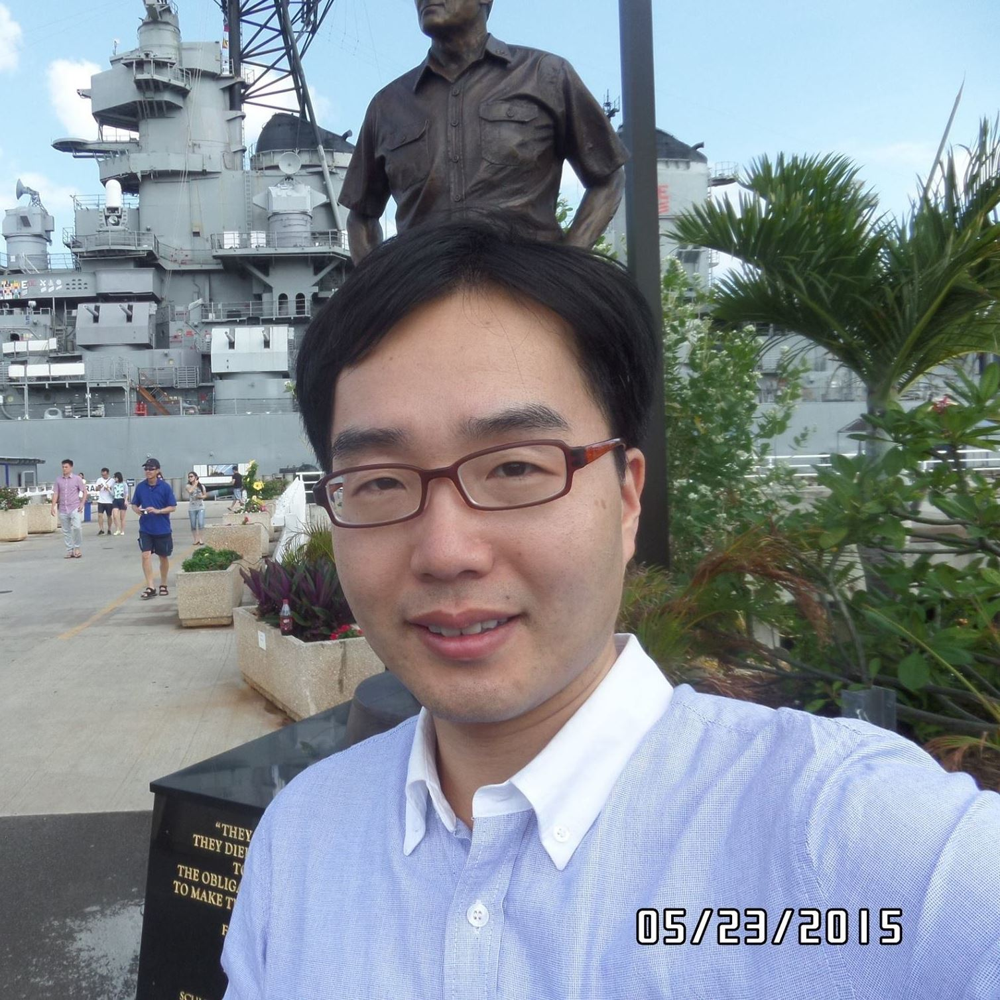

## Corporate Vice President, Samsung Research

### Head of Speech Processing Lab., AI Research Team,
### Samsung Research, Seoul South Korea

#### Phone: +82-10-4043-3996
#### E-mail: chanw.com at samsung.com, chanwcom at gmail.com

----------------------------------------------------------------------

### Research Area
#### -  End-to-end fully neural speech recognition
#### - End-to-end fully neural Text-to-Speech (TTS)
#### - Speech pre-processing and enhancement
#### - Language processing and modeling

----------------------------------------------------------------------

For papers refer to the following Google Scholar link:
 - [Google-Scholar](https://scholar.google.com/citations?user=pJoZXxYAAAAJ&hl=en&oi=ao)
 - [Linked-In Page](https://www.linkedin.com/in/chanwoo-kim-2628a622/)
 - [Research gate](https://www.researchgate.net/profile/Chanwoo-Kim-4)
 - [Facebook](https://www.facebook.com/chanwcom)
 - [Previous CMU CS website - No longer updated from 2017](http://www.cs.cmu.edu/~chanwook/)

[//]: # Updating the picture
[//]: # I referred to the following webiste.
[//]: # (This is a comment on a new line.)
[//]: # (This is a comment on a new line.)
[//]: # Adds links to school and departments.
[//]: # Things to do
[//]: # Update 3 ICASSP papers to CV.
[//]: # Updates publications.
[//]: # Updates research interests.

----------------------------------------------------------------------

### Education

 - Ph. D. Language and Information Technologies, School of Computer Science, Carnegie Mellon University, Dec. 2010.

 - M. S. Dept. of Electrical and Computer Engineering, Seoul National University, Feb. 2001.

 - B. S. Dept. of Electrical Engineering, Seoul National University, Feb. 1998.

 - Seoul Science High School, Feb. 1994.

----------------------------------------------------------------------

### Work Experience

 - Samsung Research, Corporate Vice President, Head of Speech Processing Lab.  Seoul, South Korea\
   (Feb. 2018 ~ Present)

 - Google, Senior Software Engineer, Google Speech, Mountain View, CA, USA\
   (Feb. 19th, 2013 ~ Feb. 18th, 2018)
 
 - Microsoft, Speech Scientist, Redmond, WA, USA\
   (Jan. 4th, 2011 ~ Jan. 30th, 2013)

 - LG Electronics, Senior Research Engineer, Seoul, South Korea\
   (June 3rd, 2003 ~ Aug. 8th, 2005)

 - Edumediatek, Research Engineer, Seoul, South Korea\
   (2000 ~ 2002)

----------------------------------------------------------------------

### Award
  - (1st-author) IEEE Signal Processing Society Best Paper Award, 2019.
  - (1st-author) 17-th Samsung Human Tech Thesis Bronze Prize, Feb., 2011.
  - (1st-author) 16-th, Samsung Human Tech Thesis Honour Prize, Feb., 2010.
  - Research Fellowship for Ph. D. study (2005-2010), Carnegie Mellon
    University, Jan. 2005.
  - Scholarship for studying abroad (2005-2007), Korea Institute of Energy Evaluation and
    Planning, July 2005.
  - Graduate cum laude with a bachelors degree, Seoul National University, Feb.
    1998.

----------------------------------------------------------------------

### Commercialization achievements
  - Samsung on-device end-to-end neural speech recognition for room and floor air
    conditioners
  - Samsung on-device end-to-end neural speech recognition for dictation on mobile phones
  - Samsung on-device neural Text-To-Speech (TTS) for Android
  - Samsung cloud neural Text-To-Speech (TTS) for Bixby
  - Speech pre-processing and wakeup for Galaxy Home Mini.
  - Speech pre-processing for Room Air Conditioners
  - Sound Event Detection engine for Samsung Robot Vacuum Cleaners. 
  - Data-augmentation for speech recognition used in Google Home and Google Voice Search
  - Acoustic Modeling (AM) of Google speech recognition systems for Google
    Assistants and Google Voice

----------------------------------------------------------------------

### Professional Services
  - IEEE ICASSP 2024 Organizing Committee
  - INTERSPEECH 2022 Industry Liaison Chair
  - INTERSPEECH 2020 Session Chair
  - AAAI 2019 Senior Program Committee (SPC)
  - Reviewers for various conferences and journals including ICASSP,
    INTERSPEECH, Eurasip Journals, Signal Processing Systems, Speech
Communication, and so on.

### Short Biography

Chanwoo Kim has been a corporate vice president at Samsung research leading the speech processing Lab since Feb. 2018. He has led the end-to-end speech recognition and end-to-end text-to-speech (TTS) research and development at Samsung Research. He has been also working for far-field speech enhancement, key-word spotting and so on. End-to-end ASR and TTS systems have been commercialized for various Samsung products. He was a software engineer at Google speech team between Feb. 2013 and Feb. 2018. He worked for acoustic modeling for speech recognition systems and enhancing noise robustness using deep learning techniques. While working for Google, he contributed to data-augmentation and acoustic modeling of Google speech recognition systems. He was a speech scientist at Microsoft from Jan. 2011 to Jan. 2013. Dr. Kim received his Ph. D. from the Language Technologies Institute of School of Computer Science Carnegie Mellon University in Dec. 2010. He received his B.S and M.S. degrees in Electrical Engineering from Seoul National University in 1998 and 2001, respectively. Dr. Kim’s doctoral research was focused on enhancing the robustness of automatic speech recognition systems in noisy environments. Between 2003 and 2005 Dr. Kim was a Senior Research Engineer at LG Electronics, where he worked primarily on embedded signal processing and protocol stacks for multimedia systems. Prior to his employment at LG, he worked for EdumediaTek and SK Teletech as a R&D engineer. 
